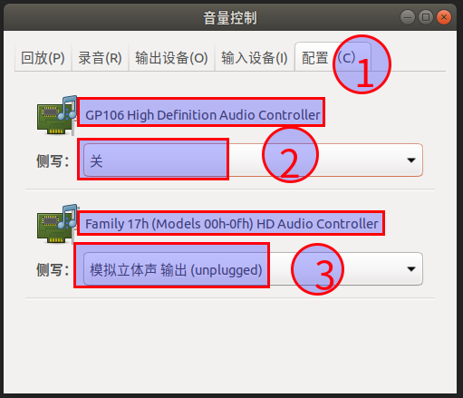
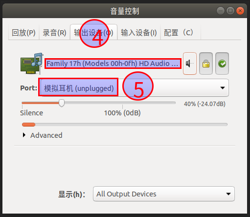
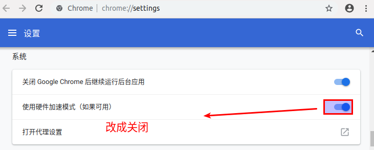

## 都切换到root用户进行命令操作

### 删除LibreOffice
```
sudo apt remove -y libreoffice-calc libreoffice-draw libreoffice-impress libreoffice-writer libreoffice*
```
### 配置阿里云加速器
```
echo "deb http://mirrors.aliyun.com/ubuntu/ $(lsb_release -cs) main restricted universe multiverse" > /etc/apt/sources.list
echo "deb http://mirrors.aliyun.com/ubuntu/ $(lsb_release -cs)-security main restricted universe multiverse" >> /etc/apt/sources.list
echo "deb http://mirrors.aliyun.com/ubuntu/ $(lsb_release -cs)-updates main restricted universe multiverse" >> /etc/apt/sources.list
echo "deb http://mirrors.aliyun.com/ubuntu/ $(lsb_release -cs)-proposed main restricted universe multiverse" >> /etc/apt/sources.list
echo "deb http://mirrors.aliyun.com/ubuntu/ $(lsb_release -cs)-backports main restricted universe multiverse" >> /etc/apt/sources.list
apt-get update && apt-get clean && apt-get autoclean && apt-get clean && apt-get autoremove
```

### 安装python-3.7 (阿里源仓库有python3.7的安装包)
```
apt-get install python3.7-dev
apt-get install python3.7
apt-get install python3-pip

# 设置python3.7为默认版本
rm -rf /usr/bin/python
ln -s /usr/bin/python3.6 /usr/bin/python

# 在root用户下执行一次，在普通用户下执行一次
mkdir -p ~/.pip
echo "[global]" > ~/.pip/pip.conf
echo "index-url=http://mirrors.aliyun.com/pypi/simple/" >> ~/.pip/pip.conf
echo "[install]" >> ~/.pip/pip.conf
echo "trusted-host=mirrors.aliyun.com" >> ~/.pip/pip.conf

```

### 安装ssh
```
# 查看是否已经安装ssh
ps -e | grep ssh
apt-get install -y openssh-server

# 配置sshd参数
cat /etc/ssh/sshd_config | grep PubkeyAuthentication
cat /etc/ssh/sshd_config | grep PasswordAuthentication
cat /etc/ssh/sshd_config | grep UseDNS
cat /etc/ssh/sshd_config | grep GSSAPIAuthentication
cat /etc/ssh/sshd_config | grep PermitRootLogin
sed -ri 's/^#?PubkeyAuthentication\s+.*/PubkeyAuthentication yes/' /etc/ssh/sshd_config ;
sed -ri 's/^PasswordAuthentication\s+.*/PasswordAuthentication yes/' /etc/ssh/sshd_config ;
sed -ri 's/^GSSAPIAuthentication\s+.*/GSSAPIAuthentication no/' /etc/ssh/sshd_config ;
sed -ri 's/^#PermitRootLogin\s+.*/PermitRootLogin yes/' /etc/ssh/sshd_config ;
cat /etc/ssh/sshd_config | grep PubkeyAuthentication
cat /etc/ssh/sshd_config | grep PasswordAuthentication
cat /etc/ssh/sshd_config | grep GSSAPIAuthentication
cat /etc/ssh/sshd_config | grep PermitRootLogin
systemctl restart sshd
```

### 安装docker
```
# 用root用户安装
mkdir -p /etc/apt/sources.list.d
echo "deb [arch=amd64] https://mirrors.ustc.edu.cn/docker-ce/linux/ubuntu $(lsb_release -cs) stable" > /etc/apt/sources.list.d/aliyun-docker.list

# 添加Docker公共密钥，作用应该是 apt-get 安装 http://mirrors.aliyun.com/docker-ce/linux/ubuntu/ 的docker软件时对比公钥证明仓库是合法的吧
curl -fsSL https://mirrors.aliyun.com/docker-ce/linux/ubuntu//gpg | apt-key add -

apt-get update && apt-get clean && apt-get autoclean && apt-get clean && apt-get autoremove

apt-get install -y docker-ce

mkdir -p /etc/docker
tee /etc/docker/daemon.json <<-'EOF'
{
  "registry-mirrors": ["https://docker.mirrors.ustc.edu.cn"]
}
EOF
systemctl enable docker #设置docker服务开机自启动
systemctl restart docker

# 安装docker-compose
curl -L https://mirrors.aliyun.com/docker-toolbox/linux/compose/1.21.2/docker-compose-`uname -s`-`uname -m` > /usr/local/bin/docker-compose
chmod +x /usr/local/bin/docker-compose

# groupadd docker
# usermod -aG docker hgp
# 这步是必须的，否则因为 groups 命令获取到的是缓存的组信息，刚添加的组信息未能生效，所以 docker ps -a 执行时有错。或者重启系统让用户组信息生效
# newgrp - docker

```

### 卸载gedit(在公司电脑被坑死过很多次，几十行的文件替换后，再撤销替换，电脑直接卡死，只能拔电源线强制关机，害死人了)，安装notepadqq
```
# 用root用户执行命令
# 卸载 gedit
apt-get remove gedit
add-apt-repository ppa:notepadqq-team/notepadqq
apt-get update
apt-get install notepadqq

# 卸载 notepadqq
apt-get remove notepadqq
add-apt-repository --remove ppa:notepadqq-team/notepadqq
```

### 上官网下载VSCode的deb安装包安装
```
# VSCode下载地址
# https://code.visualstudio.com/Download
sudo dpkg -i code_1.26.1-1534444688_amd64.deb
```

### 安装最新的chrome浏览器
```
wget https://dl.google.com/linux/direct/google-chrome-stable_current_amd64.deb
sudo dpkg -i google-chrome-stable_current_amd64.deb
```

### 安装搜狗输入法
```
# 去官网下载搜狗输入法  sogoupinyin_2.2.0.0108_amd64.deb
# wget http://cdn2.ime.sogou.com/dl/index/1524572264/sogoupinyin_2.2.0.0108_amd64.deb
sudo dpkg -i sogoupinyin_2.2.0.0108_amd64.deb
# sudo apt-get install -f -y       # 自动修复包的依赖
sudo apt --fix-broken install -y   # 自动修复包的依赖
sudo dpkg -i sogoupinyin_2.2.0.0108_amd64.deb
# 配置输入法 Setting -> Region & Language -> Manage Installed Languages 把Keboard input method system从IBus修改为fcitx
# 然后直接重启系统
```


### 安装virtualbox
* 必须安装Linux内核头文件依赖，virtualbox用到Linux内核头文件，否则无法创建网卡或者其他一大堆错误
```
# 查看内核版本 uname -r
# 4.18.0-16-generic
apt-get install build-essential linux-headers-`uname -r`
mkdir -p /etc/apt/sources.list.d
sudo echo "deb http://download.virtualbox.org/virtualbox/debian $(lsb_release -sc) contrib" > /etc/apt/sources.list.d/virtualbox.list
# 添加 Oracle virtualbox 公钥
wget -q https://www.virtualbox.org/download/oracle_vbox_2016.asc -O- | sudo apt-key add -
apt-get update
apt-get install -y virtualbox-5.2
# 设置 virtualbox 内核模块开机启动
systemctl enable vboxdrv
systemctl restart vboxdrv
# sudo usermod -aG vboxusers 用户名
```

### 安装vagrant
```
# 网上的人说 sudo apt-get install vagrant -y 不支持VirtualBox 5.2版，所以要去官网手动下载安装vagrant二进制包
# 官网下载页 https://www.vagrantup.com/downloads.html
# 安装2.2.4版本
wget https://releases.hashicorp.com/vagrant/2.2.4/vagrant_2.2.4_x86_64.deb
dpkg -i vagrant_2.2.4_x86_64.deb
# sudo apt-get install -f -y        # 自动修复包的依赖
sudo apt --fix-broken -y install    # 自动修复包的依赖
dpkg -i vagrant_2.2.4_x86_64.deb
```

### 截图工具
```
apt-get install -y shutter
# shutter在Ubuntu-18.04中不能编辑，要安装下面的依赖
wget https://launchpadlibrarian.net/226687719/libgoocanvas-common_1.0.0-1_all.deb
sudo dpkg -i libgoocanvas-common_1.0.0-1_all.deb
sudo apt --fix-broken -y install    # 自动修复包的依赖
wget https://launchpadlibrarian.net/226687722/libgoocanvas3_1.0.0-1_amd64.deb
sudo dpkg -i libgoocanvas3_1.0.0-1_amd64.deb
sudo apt --fix-broken -y install    # 自动修复包的依赖
wget https://launchpadlibrarian.net/330848267/libgoo-canvas-perl_0.06-2ubuntu3_amd64.deb
sudo dpkg -i libgoo-canvas-perl_0.06-2ubuntu3_amd64.deb
sudo apt --fix-broken -y install    # 自动修复包的依赖
```

### 安装钉钉 [https://github.com/nashaofu/dingtalk/releases/]
### 安装Navicat，到百度云找安装包

### 安装WPS，另外在网上下载相应字体，避免找不到字体抛错
```
# 下载WPS安装包
http://wps-community.org/download.html
```

### 更新驱动，然后重启
```
sudo ubuntu-drivers autoinstall
reboot
```

### 安装filezilla
```
sudo apt-get install filezilla
```

### ubuntu18.04 没声音解决方案
```
sudo apt install pavucontrol
sudo pavucontrol
```
* 配置步骤，图片演示  
  
  

### 视频播放器 smplayer
```
sudo apt-get install -y smplayer
```

### 视频播放器 vlc
```
sudo apt-get install -y vlc
```

### 安装 audacious 音乐播放器
```
sudo apt-get install audacious
# 解决乱码的操作，在导航菜单依次点击  文件 -> 设置 -> 播放列表 -> 自动检测下拉编码 -> 选中汉语
# 解决乱码的操作，在导航菜单依次点击  文件 -> 设置 -> 播放列表 -> 备用字符编码 -> 输入 GBK
```


### 安装shadowsocks，Ubuntu-18.04(2019年4月2号，此时还没有Ubuntu-18.04-bionic的版本，只能用Ubuntu-16.04-xenial版本)，适用于Ubuntu-16.04
```
# sudo add-apt-repository ppa:hzwhuang/ss-qt5 必须执行这句，否则安装shadowsocks-qt5，会提示 "由于没有公钥，无法验证下列签名"
sudo add-apt-repository ppa:hzwhuang/ss-qt5
sudo echo 'deb http://ppa.launchpad.net/hzwhuang/ss-qt5/ubuntu xenial main' > /etc/apt/sources.list.d/hzwhuang-ubuntu-ss-qt5-bionic.list
sudo apt-get update
sudo apt-get install -y --allow-unauthenticated shadowsocks-qt5
```

### 安装wine
```
# 以root用户运行下面的命令，如果运行有错，复制粘贴重新运行几遍，直到成功为止
sudo dpkg --add-architecture i386
sudo apt install wine-development
wine --version     #如果出现wine的版本则说明安装成功
sudo apt install winbind
```

### 禁止chrome硬件加速
  

### Ubuntu-18.04试了几十次登录，输入正确密码后，直接卡死在红色的界面，进入不了系统，一动不能动，只能强制按电源键断电
```
sudo apt-get remove plymouth
sudo apt-get remove xserver-xorg-video-intel
sudo apt-get install lightdm
sudo dpkg-reconfigure lightdm
# 弹出一个命令行窗口选择项，把  gdm3  改成  lightdm
sudo apt-get install ubuntu-desktop
# 然后重启，系统能登录了
reboot
```

### Ubuntu-18.04鼠标移动卡顿，有时候不能移动
```
sudo apt-get install xserver-xorg-input-all
sudo apt-get install --reinstall xserver-xorg-input-all
```